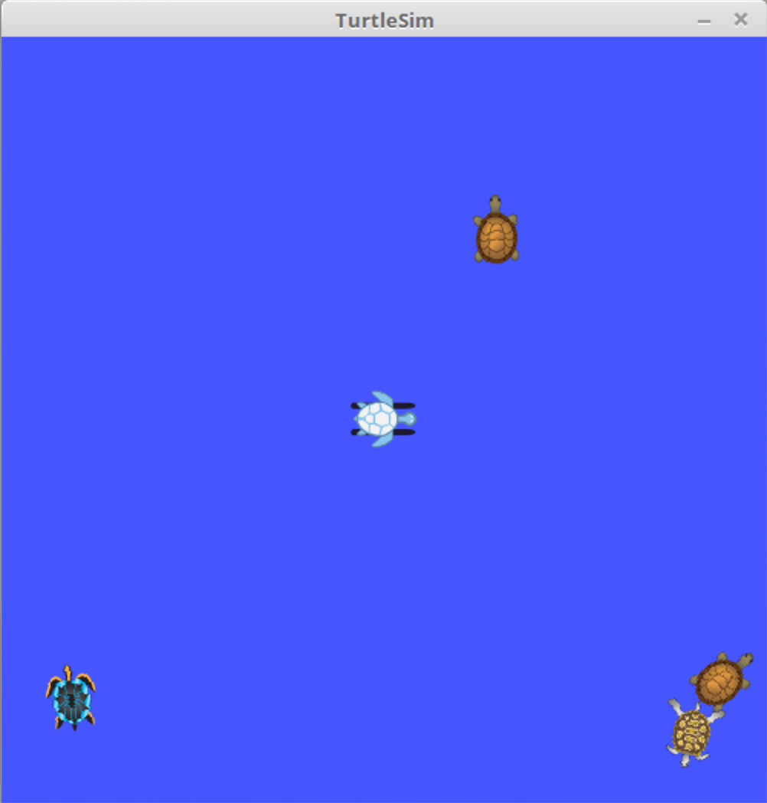
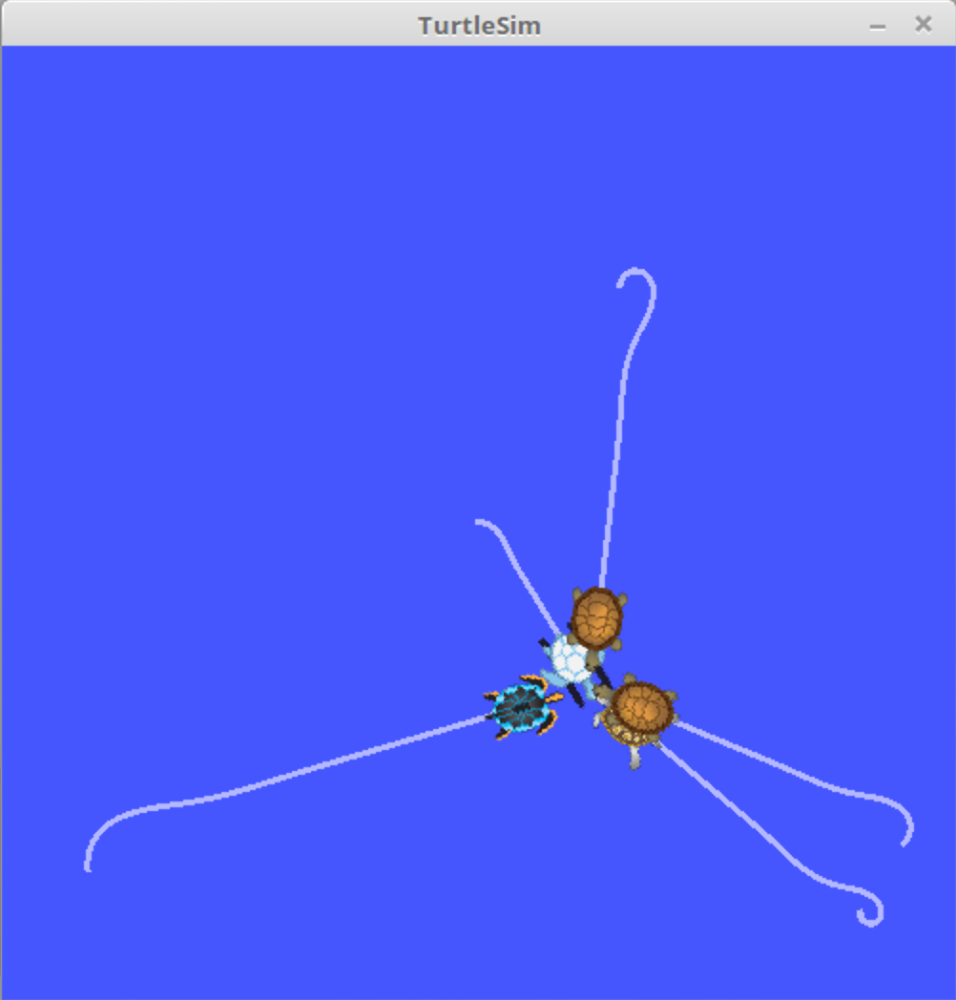
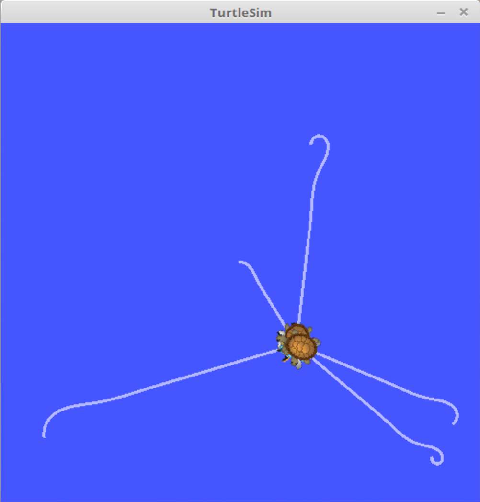

# Consensus

A ROS-based consensus protocol for multiple robots to converge towards the centroid of their positions.

<p align="center">
	<a href="#prerequisite">Prerequisite</a>
	<span> • </span>
	<a href="#compile">Compile</a>
	<span> • </span>
	<a href="#execute">Execute</a>
	<span> • </span>
	<a href="#use">Use</a>
	<span> • </span>
	<a href="#screenshots">Screenshots</a>
</p>

## <a id="prerequisite"></a>Prerequisite

* [ROS](http://wiki.ros.org/ROS/Installation) - An open-source, meta-operating system for your robots. The repository has been tested using ROS Kinetic.

## <a id="compile"></a>How to Compile
1. Move the package folder (`consensus`) to the `src` directory of your ROS workspace, for example `~/catkin_ws/src/`.

2. Open a terminal window and navigate to your ROS workspace directory:

	```bash
	cd ~/catkin_ws/
	```
3. Build the package using the `catkin_make` command:

	```bash
	catkin_make
	```
This will compile the package and generate the necessary files for running the ROS nodes.


## <a id="execute"></a>How to Execute
1. Open a terminal window.

2. Navigate to your ROS workspace directory.

3. Launch the package using the following command:

	```bash
	roslaunch consensus consensus.launch
	```
This will launch the ROS nodes required to run the package.


## <a id="use"></a>How to Use

1. Adjust the `x`, `y`, and `theta` variables in `consensus.launch` (starting from line 13) to set the initial positions of the additional robots (the first robot is spawned at the center of the workspace). Ensure that `NUM_TURTLES` in `consensus.cpp` is updated to reflect the total number of robots, including the first robot and any additional robots.
2. Each robot will communicate its position with every other robot in the network.
3. The consensus protocol will be executed on each robot in order to determine the centroid(s), which may slightly differ from the theoretical centroid.
4. Upon completion, the robots will simultaneously move toward the calculated centroid(s).
5. While the protocol is running, various types of information will be printed on the terminal. Wait until the consensus node is shut down or press `ESC` to exit the program at any time.


## <a id="screenshots"></a>Screenshots

* Initial positions:
<p align="center" width="100%">
     
</p>

* Turtles move toward the centroid(s):
<p align="center" width="100%">
     
</p>

* Turtles reach the centroid pose(s):
<p align="center" width="100%">
     
</p>
